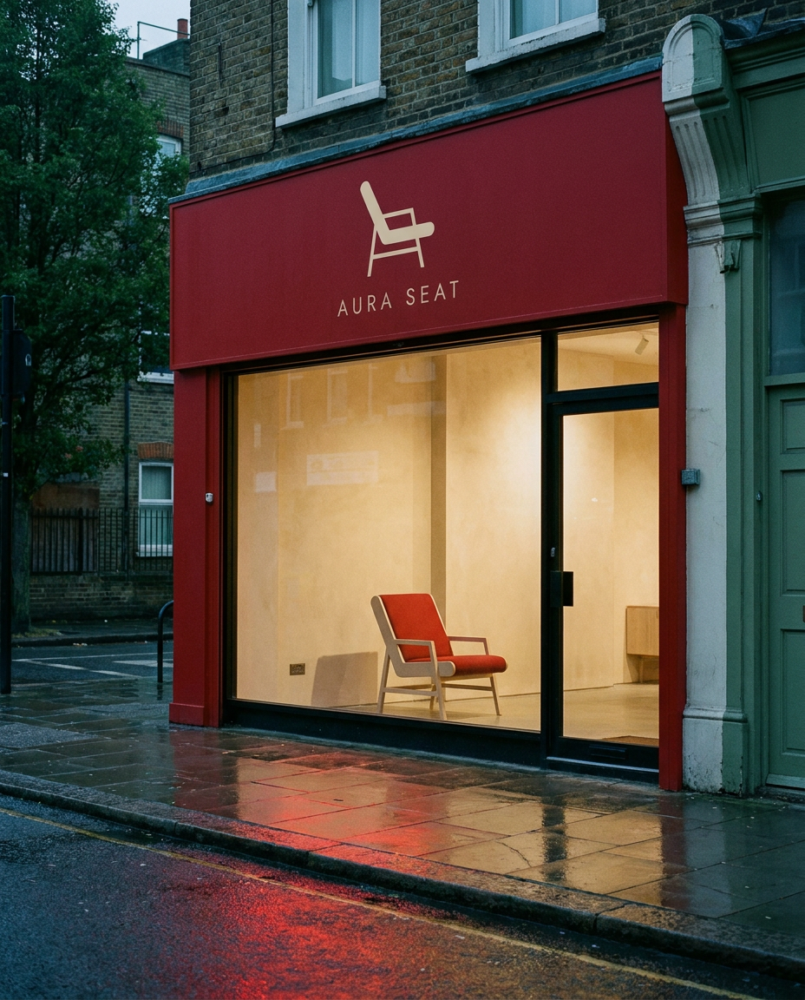

# Aura Seat — brand identity

A concept store in London that sells chairs and nothing else.

The whole system is one move: **the frame of the chair is the letter A.**
A black structural frame, a red seat, and neither half reads on its own.



---

## What is in here

```
brand/
  logo/            mark and lockups — SVG + transparent PNG, 5 colourways
  photography/     the five photographs used in the carousels
social/
  instagram/
    post-01-the-mark/       8 slides + caption + hashtags
    post-02-the-system/
    post-03-the-alphabet/
    post-04-in-print/
    post-05-the-close/
    animations/             6 films, 1080 × 1350, 60 fps
    posting-order.md        order, slide map, video slots, rules
index.html         one-page gallery — works on GitHub Pages
```

40 slides · 5 photographs · 6 films. Every post keeps its own colour mood:
cream, black, paper, red, and a closing set where the three grounds take turns.

## The system

| | | |
|---|---|---|
| Aura cream | `#F4ECDC` | 62% — carries the room |
| Signal red | `#ED0600` | 26% — the thing you notice |
| Ink black | `#000000` | 12% — the type, nothing else |

- **Jost** — wordmark, 340 tracking, caps only, never outlined
- **Archivo** — display, −35 tracking
- **Inter** — body · **JetBrains Mono** — codes `A/01` — `A/06`
- Grid: 12 columns, 74 px margin, 14 px gutter, on 1080 × 1350
- One angle only: **32°**, taken from the chair back

## The devices

Beyond the mark itself, four recurring pieces hold the identity together:

- **The aura** — five thin rings around the mark, one red. Born from the tagline,
  used on the poster, the till roll and the closing slide.
- **The 32° cut** — the chair-back angle as a diagonal wipe across covers and film.
- **The tape** — mark and wordmark repeating down 50 mm gummed paper,
  so every parcel is a moving poster.
- **The code** — `A/01`–`A/06` in mono. It brands the tag, the shelf edge and the
  receipt without a logo in sight.

## Rules that matter

1. Three grounds — cream, red, black. There is no fourth.
2. On red the mark is **cream**, never white.
3. Minimum size 16 px. Below that the seat comes off and the frame runs alone.
4. No gradients, no tints, no drop shadows, no outlined wordmark.
5. Photographs are never retouched into the palette. They either fit or they are not used.
6. No address, names or URL on anything until the doors open — "Opening soon" is the only contact line.

## Photography

| | Where | Why |
|---|---|---|
| `shopfront.png` | the alphabet, slide 2 | the identity as one object |
| `fascia.png` | in print, slide 2 | the same artwork at architectural scale |
| `business-card.png` | the mark, slide 2 | red as a material, not an ink |
| `app-icon.png` | the system, slide 2 | the mark under 48 px |
| `umbrella.png` | the close, slide 2 | one ink, wet fabric, moving |

Fixed treatment: cream tag top left, red code chip top right, one hairline foot
rule with a caption. The logo is never composited onto a photograph.

## Publishing

Order, slide map, video slots and caption rules:
[`social/instagram/posting-order.md`](social/instagram/posting-order.md).
Hashtags go in the first comment, never in the caption.

## Gallery

Enable GitHub Pages on `main` (root) and `index.html` serves the whole set.
